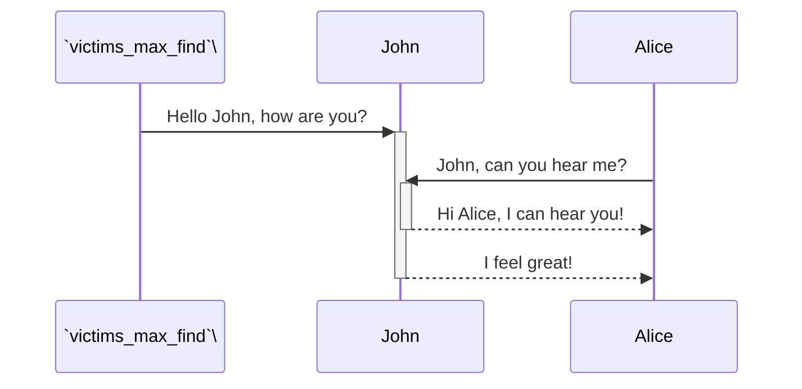

<br/>

<br/>

`VictimHost`<swm-token data-swm-token=":monkey/infection_monkey/model/host.py:4:2:2:`class VictimHost(object):`"/>
<!-- NOTE-swimm-snippet: the lines below link your snippet to Swimm -->
### 📄 monkey/infection_monkey/config.py
```python
55         def as_dict(self):
56             result = {}
57             for key in dir(Configuration):
58                 if key.startswith('_'):
59                     continue
60                 try:
61                     value = getattr(self, key)
62                 except AttributeError:
63                     continue
64     
65                 val_type = type(value)
66     
67                 if callable(value):
68                     continue
69     
70                 if val_type in (type, ABCMeta):
71                     value = value.__name__
```

<br/>


<!-- NOTE-swimm-snippet: the lines below link your snippet to Swimm -->
### 📄 monkey/infection_monkey/main.py
```python
14     from infection_monkey.config import EXTERNAL_CONFIG_FILE, WormConfiguration
15     from infection_monkey.dropper import MonkeyDrops
```

<br/>


<!-- NOTE-swimm-snippet: the lines below link your snippet to Swimm -->
<!-- NOTE-swimm-repo ::Z2l0aHViJTNBJTNBZnJvbnRlbmQtc3dpbW0lM0ElM0FyaWNhcmRvbG9wZXpn:: -->
### 📄 src/sentry/analytics/events/advanced_search_feature_gated.py
```python
7          attributes = (
8              analytics.Attribute("user_id", required=False),
9              analytics.Attribute("default_user_id"),
10             analytics.Attribute("organization_id"),
```

<br/>

<!--MERMAID {width:100}-->

<!--MCONTENT {content: "sequenceDiagram<br/>\n`victims_max_find`<swm-token data-swm-token=\":monkey/infection_monkey/config.py:135:1:1:`    victims_max_find = 100`\"/>\\->>+John: Hello John, how are you?<br/>\nAlice->>+John: John, can you hear me?<br/>\nJohn\\-\\-\\>>-Alice: Hi Alice, I can hear you!<br/>\nJohn\\-\\-\\>>-Alice: I feel great!<br/>"} --->

<br/>

This file was generated by Swimm. [Click here to view it in the app](https://app.swimm.io/repos/Z2l0aHViJTNBJTNBYmFja2VuZC1zd2ltbSUzQSUzQXJpY2FyZG9sb3Blemc=/docs/t3ad2).
