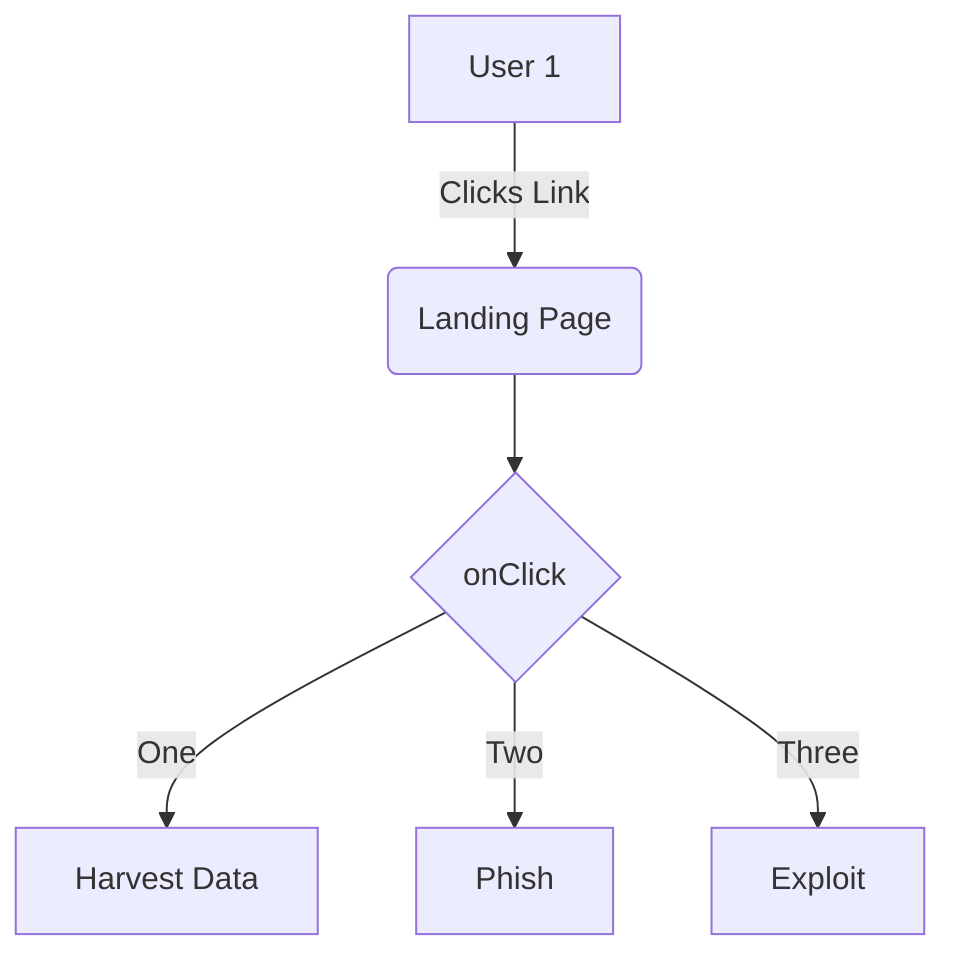

## Introduction

This doc describes the Exploit Function flow in our system. Check out this file `📄 monkey/monkey_island.py`

We'll follow Exploit Test

<br/>

This is our starting point and please ref `generate_victims_from_range`[<sup id="xuXva">↓</sup>](#f-xuXva).
<!-- NOTE-swimm-snippet: the lines below link your snippet to Swimm -->
### 📄 monkey/infection_monkey/config.py
```python
⬜ 131        exploiter_classes = []
⬜ 132        system_info_collector_classes = []
⬜ 133    
🟩 134        # how many victims to look for in a single scan iteration
🟩 135        victims_max_find = 100
⬜ 136    
⬜ 137        # how many victims to exploit before stopping
⬜ 138        victims_max_exploit = 100
```

<br/>


<!-- NOTE-swimm-snippet: the lines below link your snippet to Swimm -->
### 📄 monkey/infection_monkey/main.py
```python
⬜ 11     # noinspection PyUnresolvedReferences
⬜ 12     import infection_monkey.post_breach  # noqa: F401
⬜ 13     from common.version import get_version
🟩 14     from infection_monkey.config import EXTERNAL_CONFIG_FILE, WormConfiguration
🟩 15     from infection_monkey.dropper import MonkeyDrops
🟩 16     from infection_monkey.model import DROPPER_ARG, MONKEY_ARG
🟩 17     from infection_monkey.monkey import InfectionMonkey
🟩 18     from infection_monkey.utils.monkey_log_path import (get_dropper_log_path,
⬜ 19                                                         get_monkey_log_path)
⬜ 20     
⬜ 21     __author__ = 'itamar'
```

<br/>


<!-- NOTE-swimm-snippet: the lines below link your snippet to Swimm -->
<!-- NOTE-swimm-repo ::Z2l0aHViJTNBJTNBZnJvbnRlbmQtc3dpbW0lM0ElM0FyaWNhcmRvbG9wZXpn:: -->
### 📄 docs-ui/index.js
```javascript
⬜ 2      
⬜ 3      import ConfigStore from '../static/app/stores/configStore';
⬜ 4      
🟩 5      ConfigStore.loadInitialData({
🟩 6        gravatarBaseUrl: 'https://secure.gravatar.com',
🟩 7      
🟩 8        version: {
🟩 9          current: 'Storybook',
🟩 10       },
🟩 11       user: {
🟩 12         options: {},
🟩 13       },
🟩 14     });
⬜ 15     
```

<br/>

<!--MERMAID {width:100}-->

<!--MCONTENT {content: graph TD  
A\[User 1\] \-\-\>|Clicks Link| B(Landing Page)  
B \-\-\> C{ `onClick`[<sup id="Z1ct3W2">↓</sup>](#f-Z1ct3W2) }  
C \-\-\>|One| D\[Harvest Data\]  
C \-\-\>|Two| E\[Phish\]  
C \-\-\>|Three| F\[Exploit\]} --->

<br/>

<!-- THIS IS AN AUTOGENERATED SECTION. DO NOT EDIT THIS SECTION DIRECTLY -->
### Swimm Note

<span id="f-xuXva">generate_victims_from_range</span>[^](#xuXva) - "monkey/infection_monkey/model/victim_host_generator.py" L25
```python
    def generate_victims_from_range(self, net_range):
```

<span id="f-Z1ct3W2">onClick</span>[^](#Z1ct3W2) - "monkey/monkey_island/cc/ui/src/components/ui-components/inline-selection/BackButton.js" L21
```javascript
  onClick: PropTypes.func
```

<br/>

This file was generated by Swimm. [Click here to view it in the app](https://app.swimm.io/repos/Z2l0aHViJTNBJTNBYmFja2VuZC1zd2ltbSUzQSUzQXJpY2FyZG9sb3Blemc=/docs/dcztx).