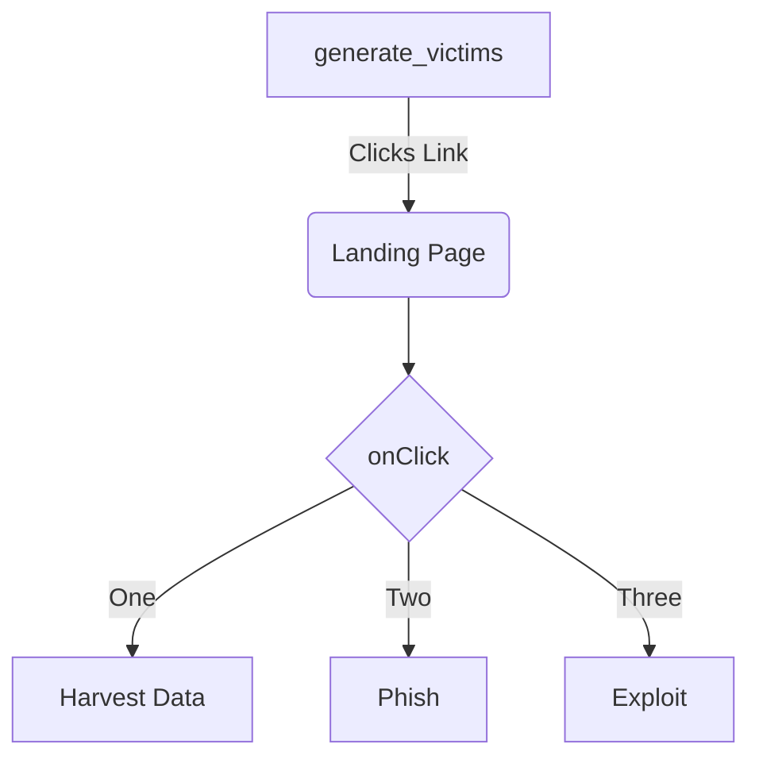

<!--MERMAID {width:100}-->

<!--MCONTENT {content: graph TD
A\[`generate_victims`[<sup id="Z1TbLj9">↓</sup>](#f-Z1TbLj9)\] \-\-\>|Clicks Link| B(Landing Page)
B \-\-\> C{`onClick`[<sup id="1AAyRO">↓</sup>](#f-1AAyRO)}
C \-\-\>|One| D\[Harvest Data\]
C \-\-\>|Two| E\[Phish\]
C \-\-\>|Three| F\[Exploit\]} --->

<br/>

<!-- THIS IS AN AUTOGENERATED SECTION. DO NOT EDIT THIS SECTION DIRECTLY -->
### Swimm Note

<span id="f-Z1TbLj9">generate_victims</span>[^](#Z1TbLj9) - "monkey/infection_monkey/model/victim_host_generator.py" L10
```python
    def generate_victims(self, chunk_size):
```

<span id="f-1AAyRO">onClick</span>[^](#1AAyRO) - "monkey/monkey_island/cc/ui/src/components/ui-components/DropdownSelect.js" L54
```javascript
  onClick: PropTypes.func
```

<br/>

This file was generated by Swimm. [Click here to view it in the app](https://app.swimm.io/repos/Z2l0aHViJTNBJTNBYmFja2VuZC1zd2ltbSUzQSUzQXJpY2FyZG9sb3Blemc=/docs/gl2nr).