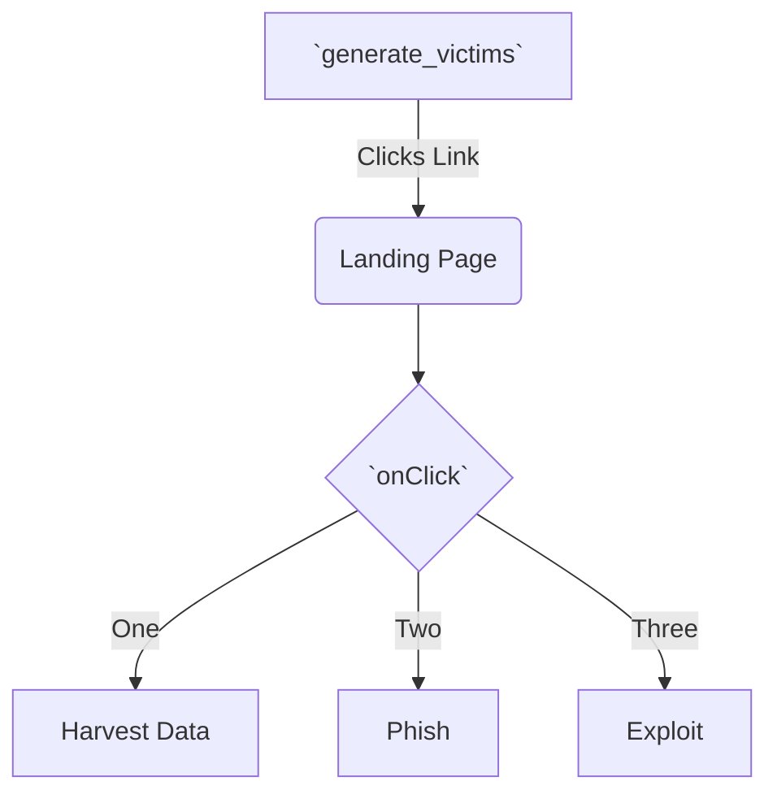

<!--MERMAID {width:100}-->

<!--MCONTENT {content: "graph TD \nA\\[`generate_victims`<swm-token data-swm-token=\":monkey/infection_monkey/model/victim_host_generator.py:10:3:3:`    def generate_victims(self, chunk_size):`\"/>\\] \\-\\-\\>|Clicks Link| B(Landing Page) \nB \\-\\-\\> C{`onClick`<swm-token data-swm-token=\":monkey/monkey_island/cc/ui/src/components/ui-components/DropdownSelect.js:54:1:1:`  onClick: PropTypes.func`\"/>} \nC \\-\\-\\>|One| D\\[Harvest Data\\] \nC \\-\\-\\>|Two| E\\[Phish\\] \nC \\-\\-\\>|Three| F\\[Exploit\\]"} --->

 

Search Term: PIQ

v2

 

This file was generated by Swimm. [Click here to view it in the app](https://app.swimm.io/repos/Z2l0aHViJTNBJTNBYmFja2VuZC1zd2ltbSUzQSUzQXJpY2FyZG9sb3Blemc=/docs/qfdd1).
