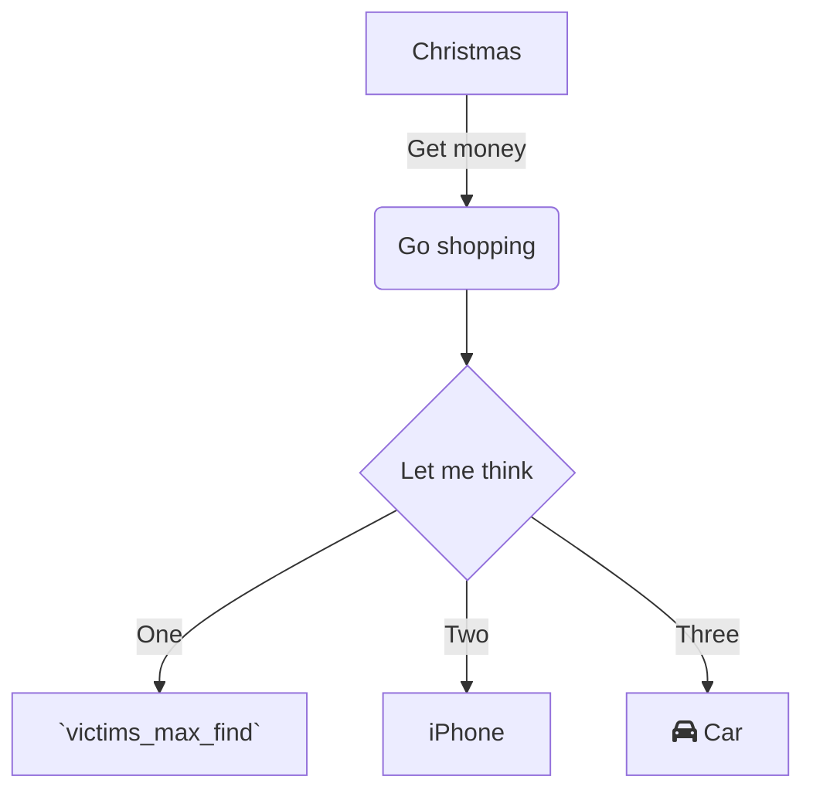

<br/>

<br/>

Pay attention to the maximum amount of `victims_max_exploit`<swm-token data-swm-token=":monkey/infection_monkey/config.py:138:1:1:`    victims_max_exploit = 100`"/> we can take advantage of.
<!-- NOTE-swimm-snippet: the lines below link your snippet to Swimm -->
### 📄 monkey/infection_monkey/config.py
```python
🟩 134        # how many victims to look for in a single scan iteration
🟩 135        victims_max_find = 100
🟩 136    
🟩 137        # how many victims to exploit before stopping
🟩 138        victims_max_exploit = 100
```

<br/>

<br/>

<br/>

Once we define our victims, we should run `exploit_host`<swm-token data-swm-token=":monkey/infection_monkey/exploit/HostExploiter.py:71:3:3:`    def exploit_host(self):`"/>.
<!-- NOTE-swimm-snippet: the lines below link your snippet to Swimm -->
### 📄 monkey/infection_monkey/exploit/HostExploiter.py
```python
🟩 71         def exploit_host(self):
🟩 72             self.pre_exploit()
🟩 73             result = None
🟩 74             try:
🟩 75                 result = self._exploit_host()
🟩 76             except Exception as _:
🟩 77                 logger.error(f'Exception in exploit_host', exc_info=True)
🟩 78             finally:
🟩 79                 self.post_exploit()
🟩 80             return result
```

<br/>

<br/>

<br/>

Make sure your environment is up to date.
<!-- NOTE-swimm-snippet: the lines below link your snippet to Swimm -->
<!-- NOTE-swimm-repo ::Z2l0aHViJTNBJTNBZnJvbnRlbmQtc3dpbW0lM0ElM0FyaWNhcmRvbG9wZXpn:: -->
### 📄 requirements-dev.txt
```text
🟩 1      before_after==1.0.1
🟩 2      docker>=3.7.0,<3.8.0
🟩 3      exam>=0.5.1
```

<br/>

<br/>

Double check your `📄(frontend-swimm) .eslintignore`

<br/>

Lets add a diagram

<br/>

<!--MERMAID {width:100}-->

<!--MCONTENT {content: "graph TD<br/>\nA\\[Christmas\\] \\-\\-\\>|Get money| B(Go shopping)<br/>\nB \\-\\-\\> C{Let me think}<br/>\nC \\-\\-\\>|One| D\\[`victims_max_find`<swm-token data-swm-token=\":monkey/infection_monkey/config.py:135:1:1:`    victims_max_find = 100`\"/>\\]<br/>\nC \\-\\-\\>|Two| E\\[iPhone\\]<br/>\nC \\-\\-\\>|Three| F\\[fa:fa-car Car\\]<br/>"} --->

<br/>

<br/>

<br/>

This file was generated by Swimm. [Click here to view it in the app](https://app.swimm.io/repos/Z2l0aHViJTNBJTNBYmFja2VuZC1zd2ltbSUzQSUzQXJpY2FyZG9sb3Blemc=/docs/13mmx).
