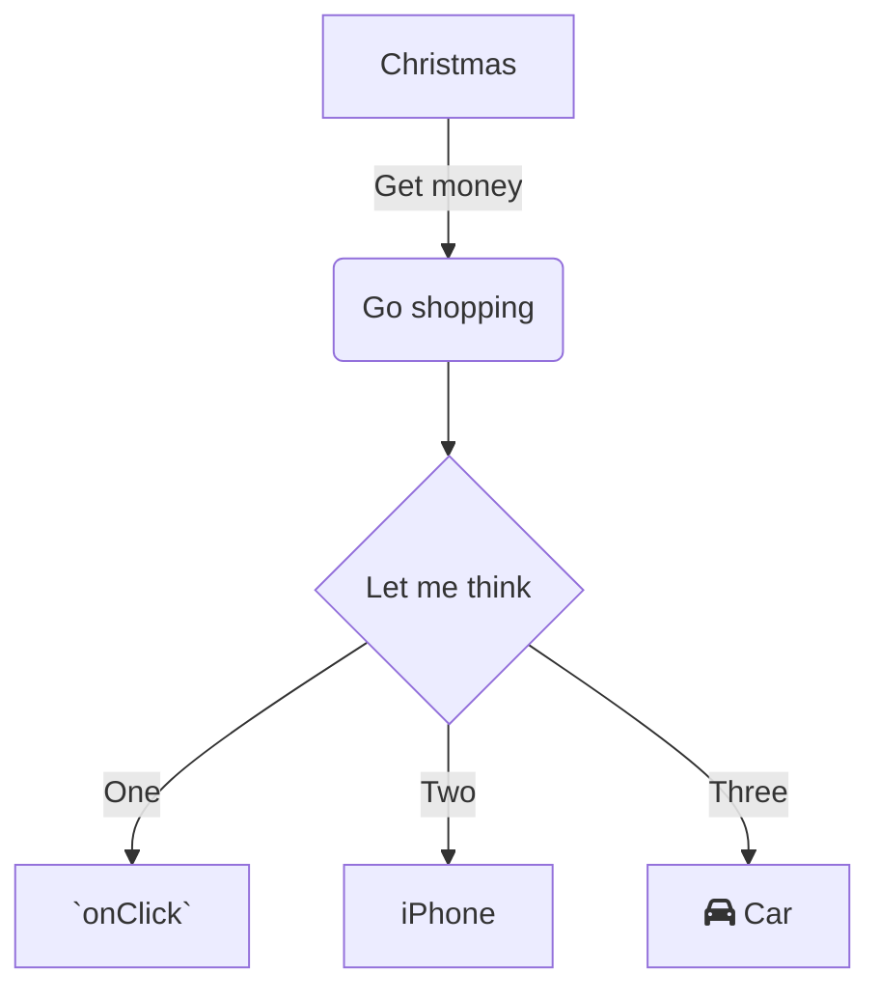

This is my first description

<br/>

<br/>


<!-- NOTE-swimm-snippet: the lines below link your snippet to Swimm -->
### 📄 monkey/infection_monkey/config.py
```python
134        # how many victims to look for in a single scan iteration
135        victims_max_find = 100
```

<br/>


<!-- NOTE-swimm-snippet: the lines below link your snippet to Swimm -->
### 📄 monkey/infection_monkey/config.py
```python
137        # how many victims to exploit before stopping
138        victims_max_exploit = 100
```

<br/>


<!-- NOTE-swimm-snippet: the lines below link your snippet to Swimm -->
### 📄 monkey/infection_monkey/monkey.py
```python
14     from common.version import get_version
15     from infection_monkey.config import WormConfiguration
16     from infection_monkey.control import ControlClient
```

<br/>

This is impt and check this `📄 .travis.yml`
<!-- NOTE-swimm-snippet: the lines below link your snippet to Swimm -->
<!-- NOTE-swimm-repo ::Z2l0aHViJTNBJTNBZnJvbnRlbmQtc3dpbW0lM0ElM0FyaWNhcmRvbG9wZXpn:: -->
### 📄 .python-version
```python-version
1      3.8.13
```

<br/>

important variable responsible for X function: `generate_victims`<swm-token data-swm-token=":monkey/infection_monkey/model/victim_host_generator.py:10:3:3:`    def generate_victims(self, chunk_size):`"/> `VictimHost`<swm-token data-swm-token=":monkey/infection_monkey/model/host.py:4:2:2:`class VictimHost(object):`"/>

<br/>

<br/>

<!--MERMAID {width:100}-->

<!--MCONTENT {content: "graph TD<br/>\nA\\[Christmas\\] \\-\\-\\>|Get money| B(Go shopping)<br/>\nB \\-\\-\\> C{Let me think}<br/>\nC \\-\\-\\>|One| D\\[`onClick`<swm-token data-swm-token=\":monkey/monkey_island/cc/ui/src/components/ui-components/inline-selection/BackButton.js:21:1:1:`  onClick: PropTypes.func`\"/>\\]<br/>\nC \\-\\-\\>|Two| E\\[iPhone\\]<br/>\nC \\-\\-\\>|Three| F\\[fa:fa-car Car\\]"} --->

<br/>

<br/>

<br/>

This file was generated by Swimm. [Click here to view it in the app](https://app.swimm.io/repos/Z2l0aHViJTNBJTNBYmFja2VuZC1zd2ltbSUzQSUzQXJpY2FyZG9sb3Blemc=/docs/wmu6s).
