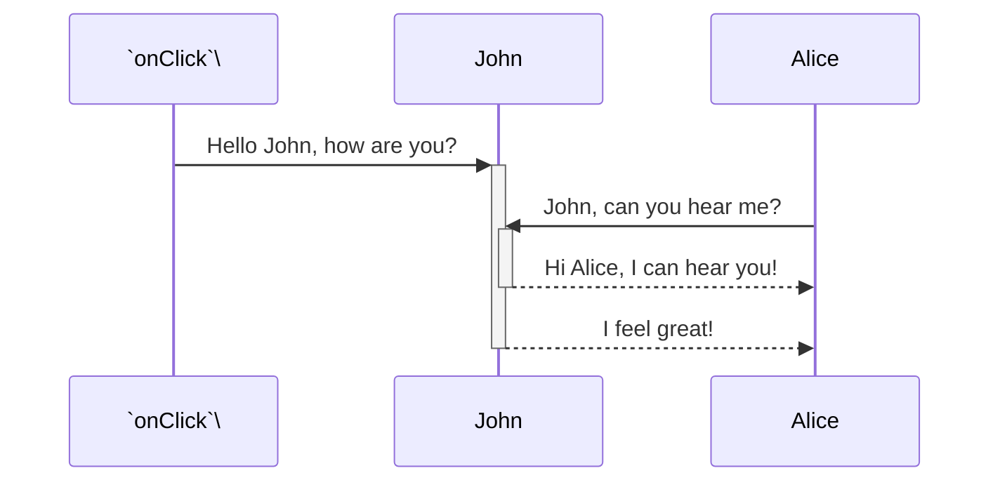

<br/>

<br/>

This file start from path: `📄 monkey/codecov.yml`
<!-- NOTE-swimm-snippet: the lines below link your snippet to Swimm -->
### 📄 monkey/infection_monkey/config.py
```python
39         def from_json(self, json_data):
40             """
41             Gets a json data object, parses it and applies it to the configuration
42             :param json_data:
43             :return:
44             """
45             formatted_data = json.loads(json_data)
46             result = self.from_kv(formatted_data)
47             return result
```

<br/>

Start the fx with `victims_max_find`<swm-token data-swm-token=":monkey/infection_monkey/config.py:135:1:1:`    victims_max_find = 100`"/>
<!-- NOTE-swimm-snippet: the lines below link your snippet to Swimm -->
### 📄 monkey/infection_monkey/monkey.py
```python
51     class InfectionMonkey(object):
52         def __init__(self, args):
53             self._keep_running = False
54             self._exploited_machines = set()
55             self._fail_exploitation_machines = set()
56             self._singleton = SystemSingleton()
57             self._parent = None
58             self._default_tunnel = None
59             self._args = args
60             self._network = None
61             self._dropper_path = None
62             self._exploiters = None
63             self._fingerprint = None
64             self._default_server = None
65             self._default_server_port = None
66             self._depth = 0
67             self._opts = None
68             self._upgrading_to_64 = False
```

<br/>


<!-- NOTE-swimm-snippet: the lines below link your snippet to Swimm -->
<!-- NOTE-swimm-repo ::Z2l0aHViJTNBJTNBZnJvbnRlbmQtc3dpbW0lM0ElM0FyaWNhcmRvbG9wZXpn:: -->
### 📄 examples/oauth2_consumer_implicit/index.js
```javascript
3      const credentials = authorize({
4        auth_uri: 'http://dev.getsentry.net:8000/oauth/authorize',
5        client_id: '49ebdc3013aa4ac08c7e811201b3a0ac36bf8fe3bcb648cf976ed57a320bbd68',
6        scope: ['project:releases', 'event:read', 'org:read', 'org:write'],
7        state: {
8          location: window.location
9        },
10     });
```

<br/>

<!--MERMAID {width:100}-->

<!--MCONTENT {content: "sequenceDiagram<br/>\n`onClick`<swm-token data-swm-token=\":monkey/monkey_island/cc/ui/src/components/ui-components/inline-selection/BackButton.js:21:1:1:`  onClick: PropTypes.func`\"/>\\->>+John: Hello John, how are you?<br/>\nAlice->>+John: John, can you hear me?<br/>\nJohn\\-\\-\\>>-Alice: Hi Alice, I can hear you!<br/>\nJohn\\-\\-\\>>-Alice: I feel great!<br/>"} --->

<br/>

<br/>

<br/>

This file was generated by Swimm. [Click here to view it in the app](https://app.swimm.io/repos/Z2l0aHViJTNBJTNBYmFja2VuZC1zd2ltbSUzQSUzQXJpY2FyZG9sb3Blemc=/docs/t2zd3).
