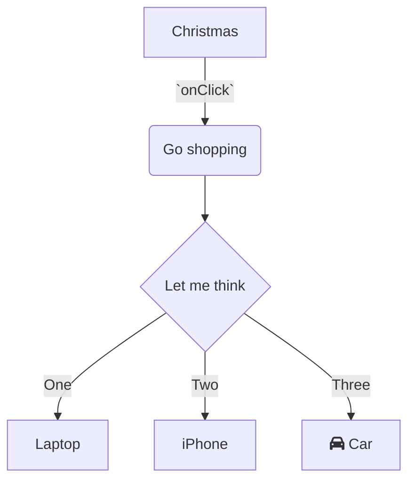

## Introduction

In this doc we will describe the API for {{API Name (e.g., sending Analytic Events)}} and how to use it correctly.

We use this API when {{use cases}}.

## API definition

## Simple usage

<br/>


<!-- NOTE-swimm-snippet: the lines below link your snippet to Swimm -->
### 📄 monkey/infection_monkey/config.py
```python
39         def from_json(self, json_data):
40             """
41             Gets a json data object, parses it and applies it to the configuration
42             :param json_data:
43             :return:
44             """
45             formatted_data = json.loads(json_data)
46             result = self.from_kv(formatted_data)
47             return result
```

<br/>

## Advanced usage: {{explain a scenario where this is needed}}

<br/>


<br/>

## Best practices and additional notes

When using this API, it is important to follow a few best practices and avoid some common mistakes.

<br/>


<br/>

<br/>

<br/>

<br/>

Check out this condition and it's impt bc.... `victims_max_find`<swm-token data-swm-token=":monkey/infection_monkey/config.py:135:1:1:`    victims_max_find = 100`"/> ----- `victims_max_find`<swm-token data-swm-token=":monkey/infection_monkey/config.py:135:1:1:`    victims_max_find = 100`"/>
<!-- NOTE-swimm-snippet: the lines below link your snippet to Swimm -->
### 📄 monkey/infection_monkey/config.py
```python
67                 if callable(value):
68                     continue
```

<br/>


<!-- NOTE-swimm-snippet: the lines below link your snippet to Swimm -->
### 📄 monkey/infection_monkey/dropper.py
```python
13     from common.utils.attack_utils import ScanStatus, UsageEnum
14     from infection_monkey.config import WormConfiguration
```

<br/>


<!-- NOTE-swimm-snippet: the lines below link your snippet to Swimm -->
<!-- NOTE-swimm-repo ::Z2l0aHViJTNBJTNBZnJvbnRlbmQtc3dpbW0lM0ElM0FyaWNhcmRvbG9wZXpn:: -->
### 📄 src/social_auth/fields.py
```python
14         def contribute_to_class(self, cls, name):
15             """
16             Add a descriptor for backwards compatibility
17             with previous Django behavior.
18             """
19             super().contribute_to_class(cls, name)
20             setattr(cls, name, Creator(self))
21     
```

<br/>

<!--MERMAID {width:100}-->

<!--MCONTENT {content: "graph TD<br/>\nA\\[Christmas\\] \\-\\-\\>|`onClick`<swm-token data-swm-token=\":monkey/monkey_island/cc/ui/src/components/ui-components/DropdownSelect.js:54:1:1:`  onClick: PropTypes.func`\"/>| B(Go shopping)<br/>\nB \\-\\-\\> C{Let me think}<br/>\nC \\-\\-\\>|One| D\\[Laptop\\]<br/>\nC \\-\\-\\>|Two| E\\[iPhone\\]<br/>\nC \\-\\-\\>|Three| F\\[fa:fa-car Car\\]<br/>"} --->

<br/>

This file was generated by Swimm. [Click here to view it in the app](https://app.swimm.io/repos/Z2l0aHViJTNBJTNBYmFja2VuZC1zd2ltbSUzQSUzQXJpY2FyZG9sb3Blemc=/docs/rynuf).
