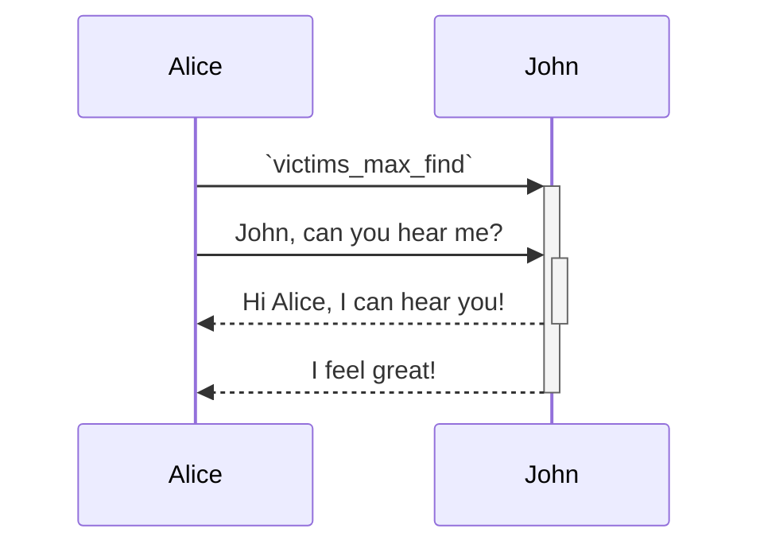

Intro message

<br/>

<br/>

<br/>

`VictimHostTelem`<swm-token data-swm-token=":monkey/infection_monkey/telemetry/attack/victim_host_telem.py:6:2:2:`class VictimHostTelem(AttackTelem):`"/>
<!-- NOTE-swimm-snippet: the lines below link your snippet to Swimm -->
### 📄 monkey/infection_monkey/config.py
```python
134        # how many victims to look for in a single scan iteration
135        victims_max_find = 100
```

<br/>


<!-- NOTE-swimm-snippet: the lines below link your snippet to Swimm -->
### 📄 monkey/infection_monkey/control.py
```python
10     import infection_monkey.monkeyfs as monkeyfs
11     import infection_monkey.tunnel as tunnel
```

<br/>


<!-- NOTE-swimm-snippet: the lines below link your snippet to Swimm -->
<!-- NOTE-swimm-repo ::Z2l0aHViJTNBJTNBZnJvbnRlbmQtc3dpbW0lM0ElM0FyaWNhcmRvbG9wZXpn:: -->
### 📄 setup.py
```python
3      import os
4      import sys
5      
6      python_version = sys.version_info[:2]
7      
8      if python_version < (3, 8):
9          sys.exit(f"Error: Sentry requires at least Python 3.8 ({python_version})")
10     if python_version != (3, 8):
11         import logging
12     
```

<br/>

<br/>

<br/>

<br/>

<!--MERMAID {width:100}-->

<!--MCONTENT {content: "sequenceDiagram<br/>\nAlice->>+John: `victims_max_find`<swm-token data-swm-token=\":monkey/infection_monkey/config.py:135:1:1:`    victims_max_find = 100`\"/><br/>\nAlice->>+John: John, can you hear me?<br/>\nJohn\\-\\-\\>>-Alice: Hi Alice, I can hear you!<br/>\nJohn\\-\\-\\>>-Alice: I feel great!<br/>"} --->

<br/>

This file was generated by Swimm. [Click here to view it in the app](https://app.swimm.io/repos/Z2l0aHViJTNBJTNBYmFja2VuZC1zd2ltbSUzQSUzQXJpY2FyZG9sb3Blemc=/docs/s3t5f).
