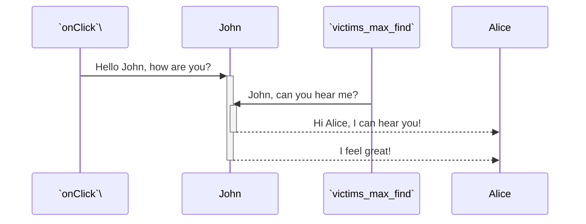

`onClick`<swm-token data-swm-token=":monkey/monkey_island/cc/ui/src/components/ui-components/DropdownSelect.js:54:1:1:`  onClick: PropTypes.func`"/> I think this event is important: `victims_max_find`<swm-token data-swm-token=":monkey/infection_monkey/config.py:135:1:1:`    victims_max_find = 100`"/> - explanation...

<br/>

`📄(frontend-swimm) .craft.yml`
<!-- NOTE-swimm-snippet: the lines below link your snippet to Swimm -->
### 📄 monkey/infection_monkey/config.py
```python
15     SENSITIVE_FIELDS = ["exploit_password_list", "exploit_user_list", "exploit_ssh_keys"]
16     LOCAL_CONFIG_VARS = ["name", "id", "current_server", "max_depth"]
```

<br/>


<!-- NOTE-swimm-snippet: the lines below link your snippet to Swimm -->
### 📄 monkey/infection_monkey/dropper.py
```python
13     from common.utils.attack_utils import ScanStatus, UsageEnum
14     from infection_monkey.config import WormConfiguration
15     from infection_monkey.exploit.tools.helpers import \
```

<br/>

<!--MERMAID {width:100}-->

<!--MCONTENT {content: "sequenceDiagram<br/>\n`onClick`<swm-token data-swm-token=\":monkey/monkey_island/cc/ui/src/components/ui-components/DropdownSelect.js:54:1:1:`  onClick: PropTypes.func`\"/>\\->>+John: Hello John, how are you?<br/>\n`victims_max_find`<swm-token data-swm-token=\":monkey/infection_monkey/config.py:135:1:1:`    victims_max_find = 100`\"/> ->>+John: John, can you hear me?<br/>\nJohn\\-\\-\\>>-Alice: Hi Alice, I can hear you!<br/>\nJohn\\-\\-\\>>-Alice: I feel great!<br/>"} --->

<br/>

This file was generated by Swimm. [Click here to view it in the app](https://app.swimm.io/repos/Z2l0aHViJTNBJTNBYmFja2VuZC1zd2ltbSUzQSUzQXJpY2FyZG9sb3Blemc=/docs/r07ei).
