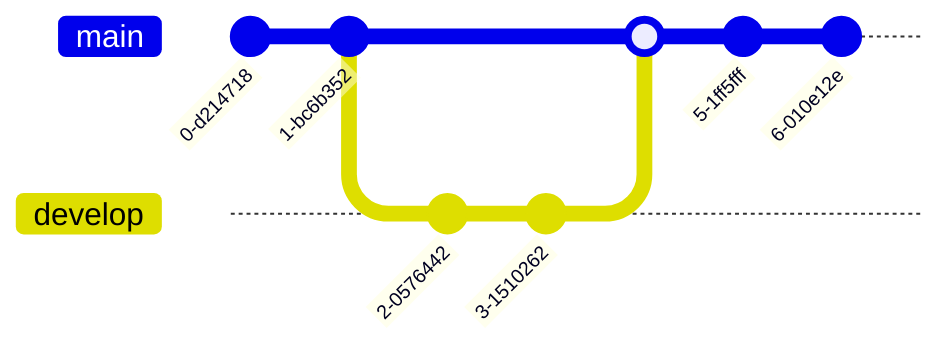

This code snippet takes a JSON data object as input, parses it, and applies it to the configuration.
<!-- NOTE-swimm-snippet: the lines below link your snippet to Swimm -->
### 📄 monkey/infection_monkey/config.py
```python
39         def from_json(self, json_data):
40             """
41             Gets a json data object, parses it and applies it to the configuration
42             :param json_data:
43             :return:
44             """
45             formatted_data = json.loads(json_data)
46             result = self.from_kv(formatted_data)
47             return result
48     
```

<br/>

<!--MERMAID {width:100}-->

<!--MCONTENT {content: "gitGraph<br/>\ncommit<br/>\ncommit<br/>\nbranch develop<br/>\ncheckout develop<br/>\ncommit<br/>\ncommit<br/>\ncheckout main<br/>\nmerge develop<br/>\ncommit<br/>\ncommit<br/>\n\n<br/>"} --->

<br/>

This file was generated by Swimm. [Click here to view it in the app](https://app.swimm.io/repos/Z2l0aHViJTNBJTNBYmFja2VuZC1zd2ltbSUzQSUzQXJpY2FyZG9sb3Blemc=/docs/dk8ykay2).
