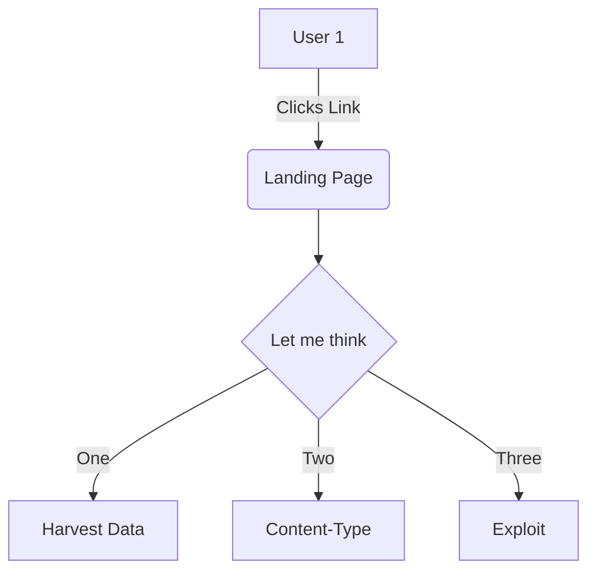

Check this function `monkeyConfig`[<sup id="hkWmf">↓</sup>](#f-hkWmf) at `📄 docs/content/setup/accounts-and-security.md`
<!-- NOTE-swimm-snippet: the lines below link your snippet to Swimm -->
### 📄 monkey/monkey_island/cc/services/config.py
```python
⬜ 33             pass
⬜ 34     
⬜ 35         @staticmethod
🟩 36         def get_config(is_initial_config=False, should_decrypt=True, is_island=False):
🟩 37             """
🟩 38             Gets the entire global config.
🟩 39             :param is_initial_config: If True, the initial config will be returned instead of the current config.
🟩 40             :param should_decrypt: If True, all config values which are set as encrypted will be decrypted.
🟩 41             :param is_island: If True, will include island specific configuration parameters.
🟩 42             :return: The entire global config.
🟩 43             """
🟩 44             config = mongo.db.config.find_one({'name': 'initial' if is_initial_config else 'newconfig'}) or {}
⬜ 45             for field in ('name', '_id'):
⬜ 46                 config.pop(field, None)
⬜ 47             if should_decrypt and len(config) > 0:
```

<br/>

<!--MERMAID {width:100}-->

<!--MCONTENT {content: graph TD
A\[User 1\] \-\-\>|Clicks Link| B(Landing Page)
B \-\-\> C{Let me think}
C \-\-\>|One| D\[Harvest Data\]
C \-\-\>|Two| E\[ `Content-Type`[<sup id="Z1de5Kn">↓</sup>](#f-Z1de5Kn)\]
C \-\-\>|Three| F\[Exploit\]

} --->

<br/>

<!-- THIS IS AN AUTOGENERATED SECTION. DO NOT EDIT THIS SECTION DIRECTLY -->
### Swimm Note

<span id="f-Z1de5Kn">Content-Type</span>[^](#Z1de5Kn) - "monkey/monkey_island/cc/ui/src/components/pages/RegisterPage.js" L31
```javascript
      'Content-Type': 'application/json'
```

<span id="f-hkWmf">monkeyConfig</span>[^](#hkWmf) - "monkey/monkey_island/cc/ui/src/components/pages/ConfigurePage.js" L57
```javascript
        let monkeyConfig = data[0];
```

<br/>

This file was generated by Swimm. [Click here to view it in the app](https://app.swimm.io/repos/Z2l0aHViJTNBJTNBYmFja2VuZC1zd2ltbSUzQSUzQXJpY2FyZG9sb3Blemc=/docs/v10e2).