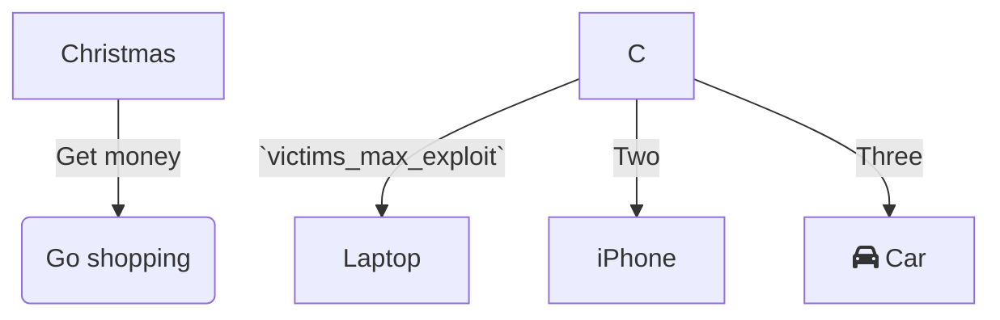

<br/>

<br/>

This is our first call. Navigate to this file: `📄 monkey/infection_monkey/control.py` Please double check `victims_max_exploit`<swm-token data-swm-token=":monkey/infection_monkey/config.py:138:1:1:`    victims_max_exploit = 100`"/>
<!-- NOTE-swimm-snippet: the lines below link your snippet to Swimm -->
### 📄 monkey/infection_monkey/config.py
```python
134        # how many victims to look for in a single scan iteration
135        victims_max_find = 100
```

<br/>

Here is the follow up.
<!-- NOTE-swimm-snippet: the lines below link your snippet to Swimm -->
### 📄 monkey/infection_monkey/main.py
```python
12     import infection_monkey.post_breach  # noqa: F401
```

<br/>

See the host IP below.
<!-- NOTE-swimm-snippet: the lines below link your snippet to Swimm -->
<!-- NOTE-swimm-repo ::Z2l0aHViJTNBJTNBZnJvbnRlbmQtc3dpbW0lM0ElM0FyaWNhcmRvbG9wZXpn:: -->
### 📄 config/relay/config.yml
```yaml
2      relay:
3        upstream: 'http://host.docker.internal:8000/'
4        host: 0.0.0.0
5        port: 7899
```

<br/>

<br/>

<br/>

<!--MERMAID {width:100}-->

<!--MCONTENT {content: "graph TD<br/>\nA\\[Christmas\\] \\-\\-\\>|Get money| B(Go shopping)<br/>\nC \\-\\-\\>|`victims_max_exploit`<swm-token data-swm-token=\":monkey/infection_monkey/config.py:138:1:1:`    victims_max_exploit = 100`\"/>| D\\[Laptop\\]<br/>\nC \\-\\-\\>|Two| E\\[iPhone\\]<br/>\nC \\-\\-\\>|Three| F\\[fa:fa-car Car\\]<br/>"} --->

<br/>

<br/>

<br/>

This file was generated by Swimm. [Click here to view it in the app](https://app.swimm.io/repos/Z2l0aHViJTNBJTNBYmFja2VuZC1zd2ltbSUzQSUzQXJpY2FyZG9sb3Blemc=/docs/ehjh1).
