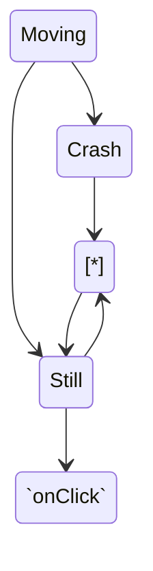

<br/>

<br/>

<br/>

<!--MERMAID {width:100}-->

<!--MCONTENT {content: "stateDiagram-v2<br/>\n\\[\\*\\] \\-\\-\\> Still<br/>\nStill \\-\\-\\> \\[\\*\\]<br/>\nStill \\-\\-\\> `onClick`<swm-token data-swm-token=\":monkey/monkey_island/cc/ui/src/components/ui-components/inline-selection/BackButton.js:21:1:1:`  onClick: PropTypes.func`\"/><br/>\nMoving \\-\\-\\> Still<br/>\nMoving \\-\\-\\> Crash<br/>\nCrash \\-\\-\\> \\[\\*\\]<br/>"} --->

<br/>

`generate_victims`<swm-token data-swm-token=":monkey/infection_monkey/model/victim_host_generator.py:10:3:3:`    def generate_victims(self, chunk_size):`"/>
<!-- NOTE-swimm-snippet: the lines below link your snippet to Swimm -->
### 📄 monkey/infection_monkey/config.py
```python
20     class Configuration(object):
21         def from_kv(self, formatted_data):
22             unknown_items = []
23             for key, value in list(formatted_data.items()):
24                 if key.startswith('_'):
25                     continue
26                 if key in LOCAL_CONFIG_VARS:
27                     continue
28                 if self._depth_from_commandline and key == "depth":
29                     self.max_depth = value
30                     continue
31                 if hasattr(self, key):
32                     setattr(self, key, value)
33                 else:
34                     unknown_items.append(key)
35             if not self.max_depth:
36                 self.max_depth = self.depth
37             return unknown_items
```

<br/>


<!-- NOTE-swimm-snippet: the lines below link your snippet to Swimm -->
<!-- NOTE-swimm-repo ::Z2l0aHViJTNBJTNBZnJvbnRlbmQtc3dpbW0lM0ElM0FyaWNhcmRvbG9wZXpn:: -->
### 📄 scripts/patches/firefox_profile.diff
```diff
3      @@ -207,3 +207,3 @@
4           def _set_manual_proxy_preference(self, key, setting):
5      -        if setting is None or setting is '':
```

<br/>

This file was generated by Swimm. [Click here to view it in the app](https://app.swimm.io/repos/Z2l0aHViJTNBJTNBYmFja2VuZC1zd2ltbSUzQSUzQXJpY2FyZG9sb3Blemc=/docs/k5463).
