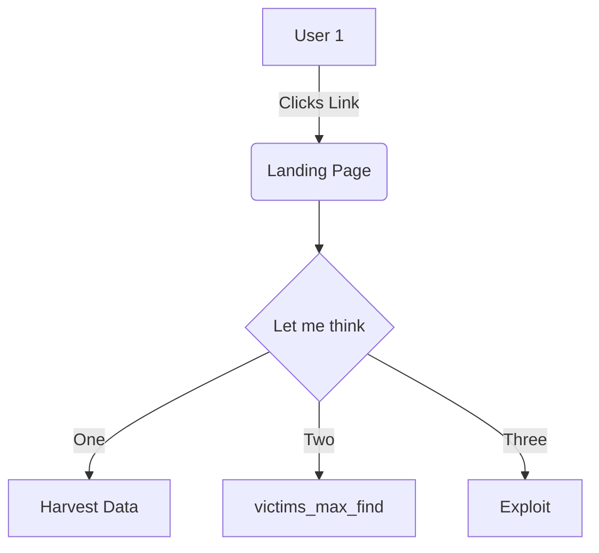

Hi there Fishman! `exploiter_classes`[<sup id="ZBDFGA">↓</sup>](#f-ZBDFGA)
<!-- NOTE-swimm-snippet: the lines below link your snippet to Swimm -->
### 📄 monkey/infection_monkey/config.py
```python
⬜ 131        exploiter_classes = []
⬜ 132        system_info_collector_classes = []
⬜ 133    
🟩 134        # how many victims to look for in a single scan iteration
🟩 135        victims_max_find = 100
⬜ 136    
⬜ 137        # how many victims to exploit before stopping
⬜ 138        victims_max_exploit = 100
```

<br/>

<!--MERMAID {width:100}-->

<!--MCONTENT {content: graph TD  
A\[User 1\] \-\-\>|Clicks Link| B(Landing Page)  
B \-\-\> C{Let me think}  
C \-\-\>|One| D\[Harvest Data\]  
C \-\-\>|Two| E\[ `victims_max_find`[<sup id="Z9sEYN">↓</sup>](#f-Z9sEYN)\]  
C \-\-\>|Three| F\[Exploit\]} --->

<br/>

<!-- THIS IS AN AUTOGENERATED SECTION. DO NOT EDIT THIS SECTION DIRECTLY -->
### Swimm Note

<span id="f-ZBDFGA">exploiter_classes</span>[^](#ZBDFGA) - "monkey/infection_monkey/config.py" L131
```python
    exploiter_classes = []
```

<span id="f-Z9sEYN">victims_max_find</span>[^](#Z9sEYN) - "monkey/infection_monkey/config.py" L135
```python
    victims_max_find = 100
```

<br/>

This file was generated by Swimm. [Click here to view it in the app](https://app.swimm.io/repos/Z2l0aHViJTNBJTNBYmFja2VuZC1zd2ltbSUzQSUzQXJpY2FyZG9sb3Blemc=/docs/aj2xk).