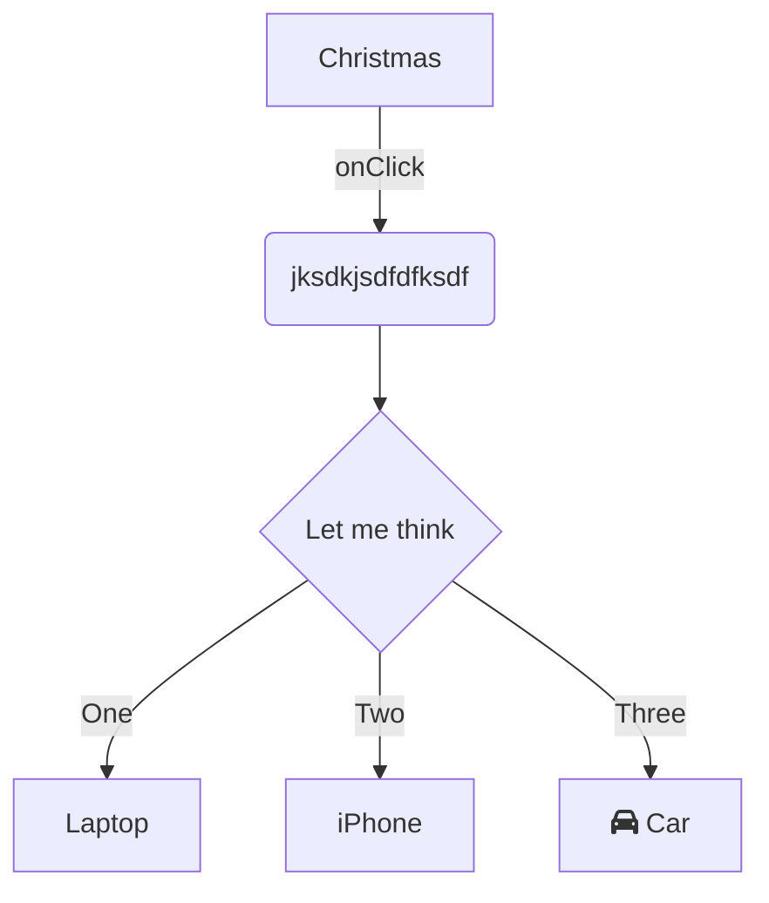

Lets start with a directory here: `📄 monkey/infection_monkey/config.py`

<br/>

<br/>

Check out `victims_max_exploit`[<sup id="1s4mS6">↓</sup>](#f-1s4mS6)
<!-- NOTE-swimm-snippet: the lines below link your snippet to Swimm -->
### 📄 monkey/infection_monkey/config.py
```python
⬜ 131        exploiter_classes = []
⬜ 132        system_info_collector_classes = []
⬜ 133    
🟩 134        # how many victims to look for in a single scan iteration
🟩 135        victims_max_find = 100
⬜ 136    
⬜ 137        # how many victims to exploit before stopping
⬜ 138        victims_max_exploit = 100
```

<br/>


<!-- NOTE-swimm-snippet: the lines below link your snippet to Swimm -->
### 📄 monkey/infection_monkey/control.py
```python
⬜ 7      import requests
⬜ 8      from requests.exceptions import ConnectionError
⬜ 9      
🟩 10     import infection_monkey.monkeyfs as monkeyfs
🟩 11     import infection_monkey.tunnel as tunnel
⬜ 12     from common.data.api_url_consts import T1216_PBA_FILE_DOWNLOAD_PATH
⬜ 13     from infection_monkey.config import GUID, WormConfiguration
⬜ 14     from infection_monkey.network.info import check_internet_access, local_ips
```

<br/>

<br/>

<br/>


<!-- NOTE-swimm-snippet: the lines below link your snippet to Swimm -->
<!-- NOTE-swimm-repo ::Z2l0aHViJTNBJTNBZnJvbnRlbmQtc3dpbW0lM0ElM0FyaWNhcmRvbG9wZXpn:: -->
### 📄 package.json
```json
⬜ 1      {
🟩 2        "name": "Sentry",
🟩 3        "version": "0.0.0",
🟩 4        "private": true,
🟩 5        "repository": {
🟩 6          "type": "git",
🟩 7          "url": "git://github.com/getsentry/sentry.git"
🟩 8        },
⬜ 9        "dependencies": {
⬜ 10         "@babel/core": "~7.17.5",
⬜ 11         "@babel/plugin-proposal-decorators": "~7.17.2",
```

<br/>

<br/>

<br/>

<!--MERMAID {width:100}-->

<!--MCONTENT {content: graph TD<br/>
A\[Christmas\] \-\-\>| `onClick`[<sup id="Z1ct3W2">↓</sup>](#f-Z1ct3W2) | B( `jksdkjsdfdfksdf` )<br/>
B \-\-\> C{Let me think}<br/>
C \-\-\>|One| D\[Laptop\]<br/>
C \-\-\>|Two| E\[iPhone\]<br/>
C \-\-\>|Three| F\[fa:fa-car Car\]} --->

<br/>

<!-- THIS IS AN AUTOGENERATED SECTION. DO NOT EDIT THIS SECTION DIRECTLY -->
### Swimm Note

<span id="f-Z1ct3W2">onClick</span>[^](#Z1ct3W2) - "monkey/monkey_island/cc/ui/src/components/ui-components/inline-selection/BackButton.js" L21
```javascript
  onClick: PropTypes.func
```

<span id="f-1s4mS6">victims_max_exploit</span>[^](#1s4mS6) - "monkey/infection_monkey/config.py" L138
```python
    victims_max_exploit = 100
```

<br/>

This file was generated by Swimm. [Click here to view it in the app](https://app.swimm.io/repos/Z2l0aHViJTNBJTNBYmFja2VuZC1zd2ltbSUzQSUzQXJpY2FyZG9sb3Blemc=/docs/9doxk).